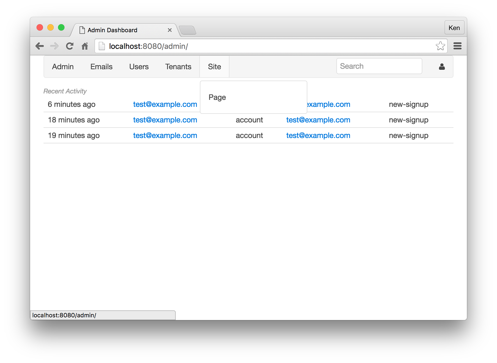
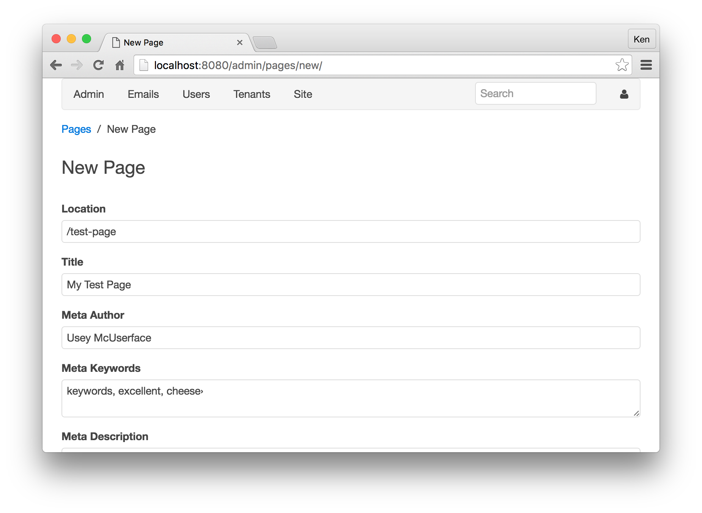

# GAE Starter Kit Tutorial

Think of GAEStarterKit as a common trunk for other App Engine projects. It adds the "missing pieces" most projects need, but don't get from the default App Engine SDK, from having a responsive HTML5 framework to letting users login with multiple methods.

## Getting Strarted

### Requirements

Before digging into any code, make sure you have the [Python App Engine SDK installed](https://cloud.google.com/appengine/downloads). If you aren't familiar with App Engine, you should [probably familiarize yourself](https://cloud.google.com/appengine/docs/python/) with Google App Engine. This tutorial assumes knowledge of [Python](https://www.python.org/) , cursory HTML, Google App Engine, and programming in general.

### Clone GAEStarterKit and make it your own

```
$ git clone https://github.com/kkinder/GAEStarterKit.git mysite
...
$ cd mysite
$ cp sample-config.py config.py
```

Edit `config.py` and edit SECRET_STRING to be something you choose that
is secure. Using a password generator is probably a good idea. Also
change the name of the site (`site_name`).

```
#
# Name of the site/product
site_name = 'My Great Site'
```

### Install required libraries
GAEStarterKit makes use of a number of third party libraries, which are specified in `requirements.txt`. App Engine works best when you bundle requirements with your application, and if you install the required libraries into the `lib` directory inside your project, everything will work out of the box.

```
pip install -r requirements.txt -t lib
```

### Testing the site

Now, you are able to start the App Engine [development server](https://cloud.google.com/appengine/docs/python/tools/devserver).

```
$ dev_appserver.py .
INFO     2016-04-13 23:59:14,856 sdk_update_checker.py:229] Checking for updates to the SDK.
WARNING  2016-04-13 23:59:15,929 simple_search_stub.py:1126] Could not read search indexes from /var/folders/0t/3cby25yd1x5d6rk0lz670zzw0000gn/T/appengine.gaestarterkit.kkinder/search_indexes
INFO     2016-04-13 23:59:15,932 api_server.py:204] Starting API server at: http://localhost:50866
INFO     2016-04-13 23:59:15,935 dispatcher.py:197] Starting module "default" running at: http://localhost:8080
INFO     2016-04-13 23:59:15,937 admin_server.py:118] Starting admin server at: http://localhost:8000
```

Follow the link from the output above to `http://localhost:8080`. If you see a welcome page describing GAEStarterKit, you're all set.

### Running the test suite

Run `run-tests.py` to run all of GAEStarterKit's unit tests and confirm that they are working before making further code changes.

```
python run-tests.py
test_login_redirect (apps.users.tests.test_login_logout.EmailSignupTestCase) ... ok

...

OK
```

### Rebuilding static asssets

Although GAEStarterKit ships with fully built assets for jquery, parsley, uikit, and more, you can further customzie your assets. Use `build-assets.py` to rebuild the concatenated files. Edit the script to include your own client-side CSS and Java/CoffeeScript tools.

```
$ python build-assets.py
/static/all.js?d4bb3601
/static/all.css?e538e9d9
/static/tenant-overview.js?234017aa
```

## Test out simplecms

From here, try navigating to http://localhost:8080/admin/ to checkout the admin area. When prompted to login, use Google and specify your login as a superuser. Try adding pages to the simplecms:




For location, specify /test-page and enter some experimental data in each field. Note that content is Markdown, and you get a preview of its output right away. Save changes.



After saving your work, navigate to the page's new location at http://localhost:8080/test-page/.

## Getting things done

Note that `simplecms` is primarily provided as an example app. You can desiign your own application using it as a starter template. When creating a new package in the `apps` directory, make sure to add it to `installed_apps` in `config.py`.

## Getting help

* [Google Plus community](https://plus.google.com/communities/106743474212519609836)
* [Github page](https://github.com/kkinder/GAEStarterKit)
